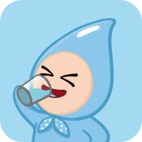

# Dewy Days
<a href="https://dewydays.vercel.app/" target="_blank">
 
</a> 

## Introduction
Dewy Days is a water traker application that I designed for my graduation project in 2015, and the prototype is built in 2024.

## Features
* Interactive UI and character reaction when water is added
* Real-time weather updates provided from [Open Meteo API](https://open-meteo.com/)
* Setting the capacity of your water container such as cups, bottles, etc
* Addition water intake easily by adjusting the slider to the amount
* The daily goal offered based on your weight, activity level and the weather 
* Setting a water reminder to create your own routines
* Intuitive water tracking

## Built with

* UI components from [MUI](https://mui.com/material-ui/getting-started/)
* Icons from [FontAwesome](https://fontawesome.com/)